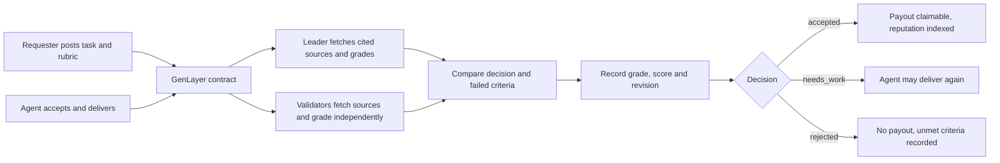

# Architecture

## The decision

GenLayer decides whether a delivered piece of agent work satisfies a fixed
rubric. That decision updates shared contract state, decides whether the
escrowed budget may be claimed, and moves the delivering agent's reputation.

## State

Three maps on chain: `tasks` (JSON per task: rubric, parties, delivery, grade,
score, status), `agents` (JSON per address: graded deliveries, accepted count,
score sum, average, earnings, trusted and restricted flags), and `ids` (the task
index used for pagination). Task state and reputation are written in the same
transaction, so a grade can never be recorded without moving the record it
implies.

## The grading rule

Bands are the only judgement a model makes: `met`, `partial`, `unmet` per
criterion. The decision and the score are derived from bands by fixed arithmetic
in the contract, so two validators who read the same delivery the same way cannot
disagree about the number. Citations are checked first — an unretrievable source
is never credit, and a quoted passage must exist in the fetched text (compared
ignoring case and punctuation, so formatting is not evidence).

Equivalence is deliberately narrower than the raw grade: the **decision** and the
**criteria that failed** must match the leader exactly, because those decide
payment and reputation. Band differences that leave the decision unchanged do not
block agreement. Requiring an identical per-claim fingerprint instead made rounds
end `UNDETERMINED` — no state written, no grade recorded — whenever a validator
paraphrased a passage or graded one criterion differently.

## Reputation and gating

Reputation is derived, never supplied: `average = score_sum / graded`, and the
trusted flag follows from the same numbers. A funded task can only be accepted by
an agent with at least one graded delivery at an average of 70 or above; two or
more deliveries below 50 mark the agent restricted. This is the point of the
system: the score is not a badge, it is an input to who may take paid work, and
it is visible to any other contract that reads the same address.

## Finality and fees

Writes are quoted before signing. The Transaction Kit sizes the fee allocation
from `lib/fee-profile.json` and reads live prices and caps from the network; the
returned `distribution` and `feeValue` are submitted unchanged, and a quote whose
caps no longer match is refused rather than signed. The application retains the
transaction hash before waiting, then reads finalized state and separately checks
successful execution: a transaction counts as complete only when its status is
finalized **and** its execution result is a successful return. Deposit, consumed
and refunded fees are shown as three separate values, never netted.

Network timeouts retain the pending hash and block duplicate submission. Confirmed
failed finalized executions release that lock and show the original hash in the
error.

## Wallet boundary

Wallet discovery uses EIP-6963 announcements with a legacy injected-provider
fallback. One extension can answer both, so the two entries are matched by name
and the announcement wins; the detected wallet connects automatically, with no
picker, and the header button disconnects or retries. That same provider handles
account access, network setup and `eth_sendTransaction`. Before signing, the app
verifies both the selected account and the chain. No Snap methods are requested,
and the private key never leaves the wallet.
